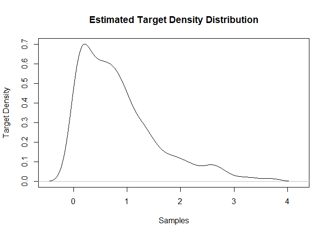
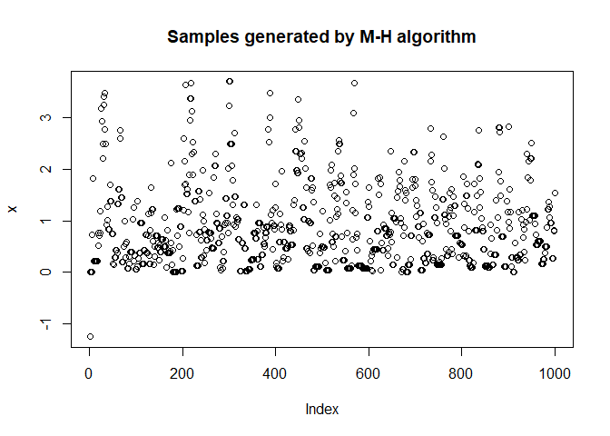
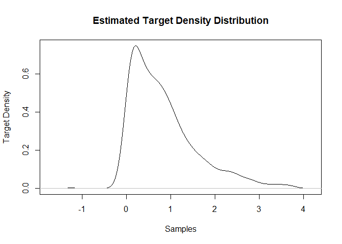

<!-- README.md is generated from README.Rmd. Please edit that file -->

# RMetropolisHastings

<!-- badges: start -->

[](https://github.com/rtiwari6-stats/RMetropolisHastings/actions/workflows/R-CMD-check.yaml)
[](https://github.com/rtiwari6-stats/RMetropolisHastings/actions/workflows/test-coverage.yaml)
<!-- badges: end -->

# Description

Metropolis-Hastings (M-H) algorithm is a markov chain based approach
that provides a way to generate samples from a distribution from which
direct sampling is difficult. It does this by simulating samples from a
different distribution from which direct sampling is easier, and
accepting those samples with a probability. We will build a R package
that implements the M-H algorithm. Our package offers support for
univariate and multivariate sampling using the M-H algorithm.

## Installation

You can install the development version of RMetropolisHastings from
[GitHub](https://github.com/rtiwari6-stats/RMetropolisHastings) with:

``` r
if (!require("devtools")){
  install.packages("devtools") 
}
#> Loading required package: devtools
#> Warning: package 'devtools' was built under R version 4.2.3
#> Loading required package: usethis
#> Warning: package 'usethis' was built under R version 4.2.3
library(devtools)
devtools::install_github("rtiwari6-stats/RMetropolisHastings")
#> Downloading GitHub repo rtiwari6-stats/RMetropolisHastings@HEAD
#> Rcpp         (1.0.9      -> 1.0.11    ) [CRAN]
#> RcppArmad... (0.12.6.6.0 -> 0.12.6.6.1) [CRAN]
#> Installing 2 packages: Rcpp, RcppArmadillo
#> Installing packages into 'C:/Users/slkoe/AppData/Local/R/win-library/4.2'
#> (as 'lib' is unspecified)
#> 
#>   There is a binary version available but the source version is later:
#>                   binary     source needs_compilation
#> RcppArmadillo 0.12.6.6.0 0.12.6.6.1              TRUE
#> 
#> package 'Rcpp' successfully unpacked and MD5 sums checked
#> Warning: cannot remove prior installation of package 'Rcpp'
#> Warning in file.copy(savedcopy, lib, recursive = TRUE): problem copying
#> C:\Users\slkoe\AppData\Local\R\win-library\4.2\00LOCK\Rcpp\libs\x64\Rcpp.dll
#> to C:\Users\slkoe\AppData\Local\R\win-library\4.2\Rcpp\libs\x64\Rcpp.dll:
#> Permission denied
#> Warning: restored 'Rcpp'
#> 
#> The downloaded binary packages are in
#>  C:\Users\slkoe\AppData\Local\Temp\RtmpYh1RAN\downloaded_packages
#> installing the source package 'RcppArmadillo'
#> ── R CMD build ─────────────────────────────────────────────────────────────────
#>       ✔  checking for file 'C:\Users\slkoe\AppData\Local\Temp\RtmpYh1RAN\remotes62058972af5\rtiwari6-stats-RMetropolisHastings-5f8a07a/DESCRIPTION' (612ms)
#>       ─  preparing 'RMetropolisHastings': (788ms)
#>    checking DESCRIPTION meta-information ...  ✔  checking DESCRIPTION meta-information
#> ─  cleaning src
#>       ─  checking for LF line-endings in source and make files and shell scripts
#>       ─  checking for empty or unneeded directories
#>      Omitted 'LazyData' from DESCRIPTION
#>       ─  building 'RMetropolisHastings_0.1.0.tar.gz'
#>      
#> 
#> Installing package into 'C:/Users/slkoe/AppData/Local/R/win-library/4.2'
#> (as 'lib' is unspecified)
```

## Examples

This is an example which shows you how to generate 1000 univariate
samples:

``` r
library(RMetropolisHastings)
targetDensity = function(x){
    return(ifelse(x<0, 0, exp(-x)))
}
start = 1.25
y1 = runivariatemh(targetDensity, sigma = 1, initial = start, plot = TRUE)
```



``` r
#print a few samples
y1[1:5]
#> [1] 1.250000 1.250000 1.045988 1.045988 1.769581
```

This is an example which shows you how to generate 1000 univariate
samples using rcpp:

``` r
library(RMetropolisHastings)
#does not take a userdefined targetDensity
start = -1.25
y1 = cppunivariatemh(targetdensity = "Exponential", sigma = 1, initial = start, plot = TRUE)
```



``` r
#print a few samples
y1[1:5]
#> [1] -1.25  0.00  0.00  0.00  0.00
```

This is an example which shows you how to generate 1000 multivariate
samples:

``` r
if (!require("Matrix")){
  install.packages("Matrix") 
}
#> Loading required package: Matrix
if (!require("stats")){
  install.packages("stats") 
}
library(RMetropolisHastings)

n = 4
M = matrix(runif(n * n), ncol = n)
sigma_matrix = as.matrix(Matrix::nearPD(M)$mat)
initial_vec = rnorm(n)

#need a target density that generates a single probability for a vector x
targetDensity_mv = function(x){
    prob = rep(0, length(x))
    for(i in 1:length(x)){
      prob[i] = ifelse(x[i] < 0, 0, exp(-x))
    }
    return(max(prob))
}
  
y1 = rmultivariatemh(targetdensity = targetDensity_mv, initial_vec = initial_vec, sigma_matrix = sigma_matrix)
#print some samples
y1[1:5]
#> [1] 1.2869276 1.2869276 0.7146032 0.7146032 1.3378602
```

This is an example which shows you how to generate 1000 multivariate
samples using rcpp:

``` r
library(RMetropolisHastings)
if (!require("Matrix")){
  install.packages("Matrix") 
}
if (!require("stats")){
  install.packages("stats") 
}
library(Matrix)
library(stats)
n = 4
M = matrix(runif(n * n), ncol = n)
sigma_matrix = as.matrix(Matrix::nearPD(M)$mat)
initial_vec = rnorm(n)

#does not take a userdefined targetDensity
y1 = cppmultivariatemh(targetdensity = "Exponential", initial_vec = initial_vec, 
                     sigma_matrix = sigma_matrix)
#print some samples
y1[1:5]
#> [1] -1.1785860 -1.0394855 -1.3177983 -0.6420437 -0.6420437
```

# References

Understanding the Metropolis-Hastings Algorithm. Siddhartha Chib and
Edward Greenberg. The American Statistician , Nov., 1995, Vol. 49, No. 4
(Nov., 1995), pp. 327-335
