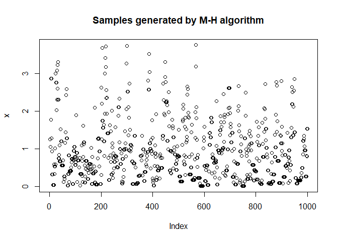

<!-- README.md is generated from README.Rmd. Please edit that file -->

# RMetropolisHastings

<!-- badges: start -->

[](https://github.com/rtiwari6-stats/RMetropolisHastings/actions/workflows/R-CMD-check.yaml)
[](https://github.com/rtiwari6-stats/RMetropolisHastings/actions/workflows/test-coverage.yaml)
<!-- badges: end -->

# Description

Metropolis-Hastings (M-H) algorithm is a markov chain based approach
that provides a way to generate samples from a distribution from which
direct sampling is difficult. It does this by simulating samples from a
different distribution from which direct sampling is easier and
accepting those samples with a probability. We will build a R package
that implements the M-H algorithm. Our package offers support for
univariate and multivariate sampling using the M-H algorithm.

## Installation

You can install the development version of RMetropolisHastings from
[GitHub](https://github.com/rtiwari6-stats/RMetropolisHastings) with:

``` r
if (!require("devtools")){
  install.packages("devtools") 
}
#> Loading required package: devtools
#> Warning: package 'devtools' was built under R version 4.2.3
#> Loading required package: usethis
#> Warning: package 'usethis' was built under R version 4.2.3
if (!require("RMetropolisHastings")){
  devtools::install_github("rtiwari6-stats/RMetropolisHastings")
}
#> Loading required package: RMetropolisHastings
```

## Examples

This is an example which shows you how to generate 1000 univariate
samples:

``` r
library(RMetropolisHastings)
targetDensity = function(x){
    return(ifelse(x<0,0,exp(-x)))
}
start = 1.25
y1 = runivariatemh(targetDensity, sigma=1, initial = start, plot = TRUE)
```



``` r
#print a few samples
y1[1:5]
#> [1] 1.250000 1.250000 1.045988 1.045988 1.769581
```

This is an example which shows you how to generate 1000 univariate
samples using rcpp:

``` r
library(RMetropolisHastings)
#does not take a userdefined targetDensity
start = -1.25
y1 = cppunivariatemh(targetdensity = "Exponential", sigma=1, initial = start, plot = TRUE)
```


``` r
#print a few samples
y1[1:5]
#> [1] -1.25  0.00  0.00  0.00  0.00
```
